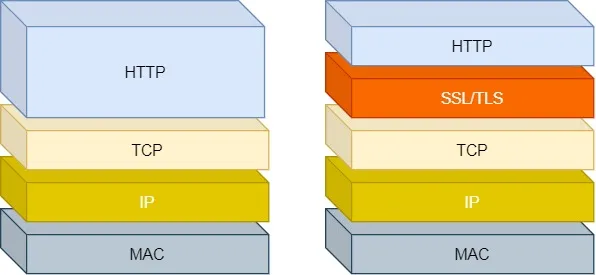
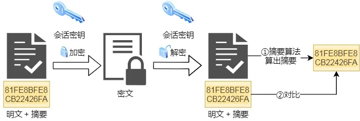
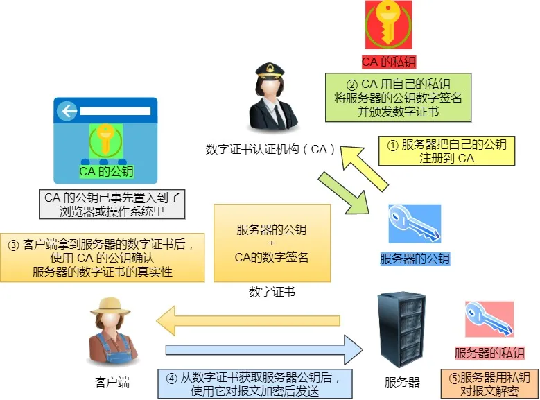
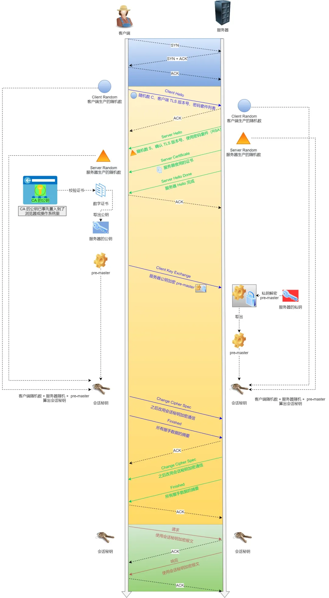
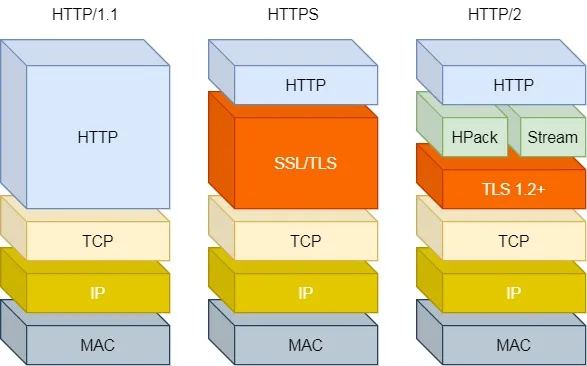
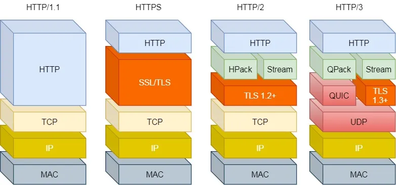
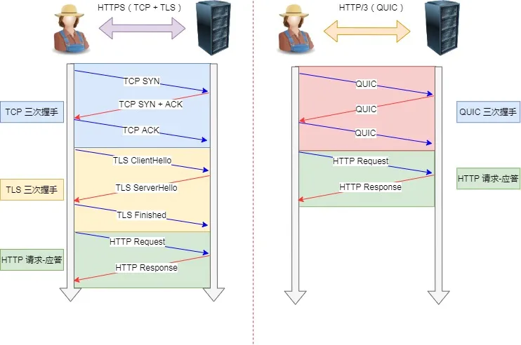

<!-- GFM-TOC -->

* [一 、基础概念](#一-基础概念)
    * [URI](#uri)
    * [请求和响应报文](#请求和响应报文)
* [二、HTTP 方法](#二http-方法)
    * [GET](#get)
    * [HEAD](#head)
    * [POST](#post)
    * [PUT](#put)
    * [PATCH](#patch)
    * [DELETE](#delete)
    * [OPTIONS](#options)
    * [CONNECT](#connect)
    * [TRACE](#trace)
* [三、HTTP 状态码](#三http-状态码)
    * [1XX 信息](#1xx-信息)
    * [2XX 成功](#2xx-成功)
    * [3XX 重定向](#3xx-重定向)
    * [4XX 客户端错误](#4xx-客户端错误)
    * [5XX 服务器错误](#5xx-服务器错误)
* [四、HTTP 首部](#四http-首部)
    * [通用首部字段](#通用首部字段)
    * [请求首部字段](#请求首部字段)
    * [响应首部字段](#响应首部字段)
    * [实体首部字段](#实体首部字段)
* [五、具体应用](#五具体应用)
    * [连接管理](#连接管理)
    * [Cookie](#cookie)
    * [缓存](#缓存)
    * [内容协商](#内容协商)
    * [内容编码](#内容编码)
    * [范围请求](#范围请求)
    * [分块传输编码](#分块传输编码)
    * [多部分对象集合](#多部分对象集合)
    * [虚拟主机](#虚拟主机)
    * [通信数据转发](#通信数据转发)
* [六、HTTPS](#六https)
    * [加密](#加密)
    * [认证](#认证)
    * [完整性保护](#完整性保护)
    * [HTTPS 的缺点](#https-的缺点)
* [七、HTTP/2.0](#七http20)
    * [HTTP/1.x 缺陷](#http1x-缺陷)
    * [二进制分帧层](#二进制分帧层)
    * [服务端推送](#服务端推送)
    * [首部压缩](#首部压缩)
* [八、HTTP/1.1 新特性](#八http11-新特性)
* [九、GET 和 POST 比较](#九get-和-post-比较)
    * [作用](#作用)
    * [参数](#参数)
    * [安全](#安全)
    * [幂等性](#幂等性)
    * [可缓存](#可缓存)
    * [XMLHttpRequest](#xmlhttprequest)
* [参考资料](#参考资料)
<!-- GFM-TOC -->


# 一 、基础概念

## URI

URI 包含 URL 和 URN。

<div align="center">  </div><br>

## 请求和响应报文

### 1. 请求报文

<div align="center">  </div><br>

### 2. 响应报文

<div align="center">  </div><br>

# 二、HTTP 方法

客户端发送的   **请求报文**   第一行为请求行，包含了方法字段。

## GET

> 获取资源

当前网络请求中，绝大部分使用的是 GET 方法。

## HEAD

> 获取报文首部

和 GET 方法类似，但是不返回报文实体主体部分。

主要用于确认 URL 的有效性以及资源更新的日期时间等。

## POST

> 传输实体主体

POST 主要用来传输数据，而 GET 主要用来获取资源。

更多 POST 与 GET 的比较请见第九章。

## PUT

> 上传文件

由于自身不带验证机制，任何人都可以上传文件，因此存在安全性问题，一般不使用该方法。

```html
PUT /new.html HTTP/1.1
Host: example.com
Content-type: text/html
Content-length: 16

<p>New File</p>
```

## PATCH

> 对资源进行部分修改

PUT 也可以用于修改资源，但是只能完全替代原始资源，PATCH 允许部分修改。

```html
PATCH /file.txt HTTP/1.1
Host: www.example.com
Content-Type: application/example
If-Match: "e0023aa4e"
Content-Length: 100

[description of changes]
```

## DELETE

> 删除文件

与 PUT 功能相反，并且同样不带验证机制。

```html
DELETE /file.html HTTP/1.1
```

## OPTIONS

> 查询支持的方法

查询指定的 URL 能够支持的方法。

会返回 `Allow: GET, POST, HEAD, OPTIONS` 这样的内容。

## CONNECT

> 要求在与代理服务器通信时建立隧道

使用 SSL（Secure Sockets Layer，安全套接层）和 TLS（Transport Layer Security，传输层安全）协议把通信内容加密后经网络隧道传输。

```html
CONNECT www.example.com:443 HTTP/1.1
```

<div align="center">  </div><br>

## TRACE

> 追踪路径

服务器会将通信路径返回给客户端。

发送请求时，在 Max-Forwards 首部字段中填入数值，每经过一个服务器就会减 1，当数值为 0 时就停止传输。

通常不会使用 TRACE，并且它容易受到 XST 攻击（Cross-Site Tracing，跨站追踪）。

# 三、HTTP 状态码

服务器返回的   **响应报文**   中第一行为状态行，包含了状态码以及原因短语，用来告知客户端请求的结果。

| 状态码 | 类别 | 含义 |
| :---: | :---: | :---: |
| 1XX | Informational（信息性状态码） | 接收的请求正在处理 |
| 2XX | Success（成功状态码） | 请求正常处理完毕 |
| 3XX | Redirection（重定向状态码） | 需要进行附加操作以完成请求 |
| 4XX | Client Error（客户端错误状态码） | 服务器无法处理请求 |
| 5XX | Server Error（服务器错误状态码） | 服务器处理请求出错 |

## 1XX 信息

-   **100 Continue**  ：表明到目前为止都很正常，客户端可以继续发送请求或者忽略这个响应。

## 2XX 成功

-   **200 OK**  

-   **204 No Content**  ：请求已经成功处理，但是返回的响应报文不包含实体的主体部分。一般在只需要从客户端往服务器发送信息，而不需要返回数据时使用。

-   **206 Partial Content**  ：表示客户端进行了范围请求，响应报文包含由 Content-Range 指定范围的实体内容。

## 3XX 重定向

-   **301 Moved Permanently**  ：永久性重定向

-   **302 Found**  ：临时性重定向

-   **303 See Other**  ：和 302 有着相同的功能，但是 303 明确要求客户端应该采用 GET 方法获取资源。

- 注：虽然 HTTP 协议规定 301、302 状态下重定向时不允许把 POST 方法改成 GET 方法，但是大多数浏览器都会在 301、302 和 303 状态下的重定向把 POST 方法改成 GET 方法。

-   **304 Not Modified**  ：如果请求报文首部包含一些条件，例如：If-Match，If-Modified-Since，If-None-Match，If-Range，If-Unmodified-Since，如果不满足条件，则服务器会返回 304 状态码。

-   **307 Temporary Redirect**  ：临时重定向，与 302 的含义类似，但是 307 要求浏览器不会把重定向请求的 POST 方法改成 GET 方法。

## 4XX 客户端错误

-   **400 Bad Request**  ：请求报文中存在语法错误。

-   **401 Unauthorized**  ：该状态码表示发送的请求需要有认证信息（BASIC 认证、DIGEST 认证）。如果之前已进行过一次请求，则表示用户认证失败。

-   **403 Forbidden**  ：请求被拒绝。

-   **404 Not Found**  

## 5XX 服务器错误

-   **500 Internal Server Error**  ：服务器正在执行请求时发生错误。

-   **503 Service Unavailable**  ：服务器暂时处于超负载或正在进行停机维护，现在无法处理请求。

# 四、HTTP 首部

有 4 种类型的首部字段：通用首部字段、请求首部字段、响应首部字段和实体首部字段。

各种首部字段及其含义如下（不需要全记，仅供查阅）：

## 通用首部字段

| 首部字段名 | 说明 |
| :--: | :--: |
| Cache-Control | 控制缓存的行为 |
| Connection | 控制不再转发给代理的首部字段、管理持久连接|
| Date | 创建报文的日期时间 |
| Pragma | 报文指令 |
| Trailer | 报文末端的首部一览 |
| Transfer-Encoding | 指定报文主体的传输编码方式 |
| Upgrade | 升级为其他协议 |
| Via | 代理服务器的相关信息 |
| Warning | 错误通知 |

## 请求首部字段

| 首部字段名 | 说明 |
| :--: | :--: |
| Accept | 用户代理可处理的媒体类型 |
| Accept-Charset | 优先的字符集 |
| Accept-Encoding | 优先的内容编码 |
| Accept-Language | 优先的语言（自然语言） |
| Authorization | Web 认证信息 |
| Expect | 期待服务器的特定行为 |
| From | 用户的电子邮箱地址 |
| Host | 请求资源所在服务器 |
| If-Match | 比较实体标记（ETag） |
| If-Modified-Since | 比较资源的更新时间 |
| If-None-Match | 比较实体标记（与 If-Match 相反） |
| If-Range | 资源未更新时发送实体 Byte 的范围请求 |
| If-Unmodified-Since | 比较资源的更新时间（与 If-Modified-Since 相反） |
| Max-Forwards | 最大传输逐跳数 |
| Proxy-Authorization | 代理服务器要求客户端的认证信息 |
| Range | 实体的字节范围请求 |
| Referer | 对请求中 URI 的原始获取方 |
| TE | 传输编码的优先级 |
| User-Agent | HTTP 客户端程序的信息 |

## 响应首部字段

| 首部字段名 | 说明 |
| :--: | :--: |
| Accept-Ranges | 是否接受字节范围请求 |
| Age | 推算资源创建经过时间 |
| ETag | 资源的匹配信息 |
| Location | 令客户端重定向至指定 URI |
| Proxy-Authenticate | 代理服务器对客户端的认证信息 |
| Retry-After | 对再次发起请求的时机要求 |
| Server | HTTP 服务器的安装信息 |
| Vary | 代理服务器缓存的管理信息 |
| WWW-Authenticate | 服务器对客户端的认证信息 |

## 实体首部字段

| 首部字段名 | 说明 |
| :--: | :--: |
| Allow | 资源可支持的 HTTP 方法 |
| Content-Encoding | 实体主体适用的编码方式 |
| Content-Language | 实体主体的自然语言 |
| Content-Length | 实体主体的大小 |
| Content-Location | 替代对应资源的 URI |
| Content-MD5 | 实体主体的报文摘要 |
| Content-Range | 实体主体的位置范围 |
| Content-Type | 实体主体的媒体类型 |
| Expires | 实体主体过期的日期时间 |
| Last-Modified | 资源的最后修改日期时间 |

# 五、具体应用

## 连接管理

<div align="center">  </div><br>

### 1. 短连接与长连接

当浏览器访问一个包含多张图片的 HTML 页面时，除了请求访问的 HTML 页面资源，还会请求图片资源。如果每进行一次 HTTP 通信就要新建一个 TCP 连接，那么开销会很大。

长连接只需要建立一次 TCP 连接就能进行多次 HTTP 通信。

- 从 HTTP/1.1 开始默认是长连接的，如果要断开连接，需要由客户端或者服务器端提出断开，使用 `Connection : close`；
- 在 HTTP/1.1 之前默认是短连接的，如果需要使用长连接，则使用 `Connection : Keep-Alive`。

### 2. 流水线

默认情况下，HTTP 请求是按顺序发出的，下一个请求只有在当前请求收到响应之后才会被发出。由于受到网络延迟和带宽的限制，在下一个请求被发送到服务器之前，可能需要等待很长时间。

流水线是在同一条长连接上连续发出请求，而不用等待响应返回，这样可以减少延迟。

## Cookie

HTTP 协议是无状态的，主要是为了让 HTTP 协议尽可能简单，使得它能够处理大量事务。HTTP/1.1 引入 Cookie 来保存状态信息。

Cookie 是服务器发送到用户浏览器并保存在本地的一小块数据，它会在浏览器之后向同一服务器再次发起请求时被携带上，用于告知服务端两个请求是否来自同一浏览器。由于之后每次请求都会需要携带 Cookie 数据，因此会带来额外的性能开销（尤其是在移动环境下）。

Cookie 曾一度用于客户端数据的存储，因为当时并没有其它合适的存储办法而作为唯一的存储手段，但现在随着现代浏览器开始支持各种各样的存储方式，Cookie 渐渐被淘汰。新的浏览器 API 已经允许开发者直接将数据存储到本地，如使用 Web storage API（本地存储和会话存储）或 IndexedDB。

### 1. 用途

- 会话状态管理（如用户登录状态、购物车、游戏分数或其它需要记录的信息）
- 个性化设置（如用户自定义设置、主题等）
- 浏览器行为跟踪（如跟踪分析用户行为等）

### 2. 创建过程

服务器发送的响应报文包含 Set-Cookie 首部字段，客户端得到响应报文后把 Cookie 内容保存到浏览器中。

```html
HTTP/1.0 200 OK
Content-type: text/html
Set-Cookie: yummy_cookie=choco
Set-Cookie: tasty_cookie=strawberry

[page content]
```

客户端之后对同一个服务器发送请求时，会从浏览器中取出 Cookie 信息并通过 Cookie 请求首部字段发送给服务器。

```html
GET /sample_page.html HTTP/1.1
Host: www.example.org
Cookie: yummy_cookie=choco; tasty_cookie=strawberry
```

### 3. 分类

- 会话期 Cookie：浏览器关闭之后它会被自动删除，也就是说它仅在会话期内有效。
- 持久性 Cookie：指定过期时间（Expires）或有效期（max-age）之后就成为了持久性的 Cookie。

```html
Set-Cookie: id=a3fWa; Expires=Wed, 21 Oct 2015 07:28:00 GMT;
```

### 4. 作用域

Domain 标识指定了哪些主机可以接受 Cookie。如果不指定，默认为当前文档的主机（不包含子域名）。如果指定了 Domain，则一般包含子域名。例如，如果设置 Domain=mozilla.org，则 Cookie 也包含在子域名中（如 developer.mozilla.org）。

Path 标识指定了主机下的哪些路径可以接受 Cookie（该 URL 路径必须存在于请求 URL 中）。以字符 %x2F ("/") 作为路径分隔符，子路径也会被匹配。例如，设置 Path=/docs，则以下地址都会匹配：

- /docs
- /docs/Web/
- /docs/Web/HTTP

### 5. JavaScript

浏览器通过 `document.cookie` 属性可创建新的 Cookie，也可通过该属性访问非 HttpOnly 标记的 Cookie。

```html
document.cookie = "yummy_cookie=choco";
document.cookie = "tasty_cookie=strawberry";
console.log(document.cookie);
```

### 6. HttpOnly

标记为 HttpOnly 的 Cookie 不能被 JavaScript 脚本调用。跨站脚本攻击 (XSS) 常常使用 JavaScript 的 `document.cookie` API 窃取用户的 Cookie 信息，因此使用 HttpOnly 标记可以在一定程度上避免 XSS 攻击。

```html
Set-Cookie: id=a3fWa; Expires=Wed, 21 Oct 2015 07:28:00 GMT; Secure; HttpOnly
```

### 7. Secure

标记为 Secure 的 Cookie 只能通过被 HTTPS 协议加密过的请求发送给服务端。但即便设置了 Secure 标记，敏感信息也不应该通过 Cookie 传输，因为 Cookie 有其固有的不安全性，Secure 标记也无法提供确实的安全保障。

### 8. Session

除了可以将用户信息通过 Cookie 存储在用户浏览器中，也可以利用 Session 存储在服务器端，存储在服务器端的信息更加安全。

Session 可以存储在服务器上的文件、数据库或者内存中。也可以将 Session 存储在 Redis 这种内存型数据库中，效率会更高。

使用 Session 维护用户登录状态的过程如下：

- 用户进行登录时，用户提交包含用户名和密码的表单，放入 HTTP 请求报文中；
- 服务器验证该用户名和密码，如果正确则把用户信息存储到 Redis 中，它在 Redis 中的 Key 称为 Session ID；
- 服务器返回的响应报文的 Set-Cookie 首部字段包含了这个 Session ID，客户端收到响应报文之后将该 Cookie 值存入浏览器中；
- 客户端之后对同一个服务器进行请求时会包含该 Cookie 值，服务器收到之后提取出 Session ID，从 Redis 中取出用户信息，继续之前的业务操作。

应该注意 Session ID 的安全性问题，不能让它被恶意攻击者轻易获取，那么就不能产生一个容易被猜到的 Session ID 值。此外，还需要经常重新生成 Session ID。在对安全性要求极高的场景下，例如转账等操作，除了使用 Session 管理用户状态之外，还需要对用户进行重新验证，比如重新输入密码，或者使用短信验证码等方式。

### 9. 浏览器禁用 Cookie

此时无法使用 Cookie 来保存用户信息，只能使用 Session。除此之外，不能再将 Session ID 存放到 Cookie 中，而是使用 URL 重写技术，将 Session ID 作为 URL 的参数进行传递。

### 10. Cookie 与 Session 选择

- Cookie 只能存储 ASCII 码字符串，而 Session 则可以存储任何类型的数据，因此在考虑数据复杂性时首选 Session；
- Cookie 存储在浏览器中，容易被恶意查看。如果非要将一些隐私数据存在 Cookie 中，可以将 Cookie 值进行加密，然后在服务器进行解密；
- 对于大型网站，如果用户所有的信息都存储在 Session 中，那么开销是非常大的，因此不建议将所有的用户信息都存储到 Session 中。

## 缓存

### 1. 优点

- 缓解服务器压力；
- 降低客户端获取资源的延迟：缓存通常位于内存中，读取缓存的速度更快。并且缓存服务器在地理位置上也有可能比源服务器来得近，例如浏览器缓存。

### 2. 实现方法

- 让代理服务器进行缓存；
- 让客户端浏览器进行缓存。

### 3. Cache-Control

HTTP/1.1 通过 Cache-Control 首部字段来控制缓存。

**3.1 禁止进行缓存**  

no-store 指令规定不能对请求或响应的任何一部分进行缓存。

```html
Cache-Control: no-store
```

**3.2 强制确认缓存**  

no-cache 指令规定缓存服务器需要先向源服务器验证缓存资源的有效性，只有当缓存资源有效时才能使用该缓存对客户端的请求进行响应。

```html
Cache-Control: no-cache
```

**3.3 私有缓存和公共缓存**  

private 指令规定了将资源作为私有缓存，只能被单独用户使用，一般存储在用户浏览器中。

```html
Cache-Control: private
```

public 指令规定了将资源作为公共缓存，可以被多个用户使用，一般存储在代理服务器中。

```html
Cache-Control: public
```

**3.4 缓存过期机制**  

max-age 指令出现在请求报文，并且缓存资源的缓存时间小于该指令指定的时间，那么就能接受该缓存。

max-age 指令出现在响应报文，表示缓存资源在缓存服务器中保存的时间。

```html
Cache-Control: max-age=31536000
```

Expires 首部字段也可以用于告知缓存服务器该资源什么时候会过期。

```html
Expires: Wed, 04 Jul 2012 08:26:05 GMT
```

- 在 HTTP/1.1 中，会优先处理 max-age 指令；
- 在 HTTP/1.0 中，max-age 指令会被忽略掉。

### 4. 缓存验证

需要先了解 ETag 首部字段的含义，它是资源的唯一标识。URL 不能唯一表示资源，例如 `http://www.google.com/` 有中文和英文两个资源，只有 ETag 才能对这两个资源进行唯一标识。

```html
ETag: "82e22293907ce725faf67773957acd12"
```

可以将缓存资源的 ETag 值放入 If-None-Match 首部，服务器收到该请求后，判断缓存资源的 ETag 值和资源的最新 ETag 值是否一致，如果一致则表示缓存资源有效，返回 304 Not Modified。

```html
If-None-Match: "82e22293907ce725faf67773957acd12"
```

Last-Modified 首部字段也可以用于缓存验证，它包含在源服务器发送的响应报文中，指示源服务器对资源的最后修改时间。但是它是一种弱校验器，因为只能精确到一秒，所以它通常作为 ETag 的备用方案。如果响应首部字段里含有这个信息，客户端可以在后续的请求中带上 If-Modified-Since 来验证缓存。服务器只在所请求的资源在给定的日期时间之后对内容进行过修改的情况下才会将资源返回，状态码为 200 OK。如果请求的资源从那时起未经修改，那么返回一个不带有实体主体的 304 Not Modified 响应报文。

```html
Last-Modified: Wed, 21 Oct 2015 07:28:00 GMT
```

```html
If-Modified-Since: Wed, 21 Oct 2015 07:28:00 GMT
```

## 内容协商

通过内容协商返回最合适的内容，例如根据浏览器的默认语言选择返回中文界面还是英文界面。

### 1. 类型

**1.1 服务端驱动型**  

客户端设置特定的 HTTP 首部字段，例如 Accept、Accept-Charset、Accept-Encoding、Accept-Language，服务器根据这些字段返回特定的资源。

它存在以下问题：

- 服务器很难知道客户端浏览器的全部信息；
- 客户端提供的信息相当冗长（HTTP/2 协议的首部压缩机制缓解了这个问题），并且存在隐私风险（HTTP 指纹识别技术）；
- 给定的资源需要返回不同的展现形式，共享缓存的效率会降低，而服务器端的实现会越来越复杂。

**1.2 代理驱动型**  

服务器返回 300 Multiple Choices 或者 406 Not Acceptable，客户端从中选出最合适的那个资源。

### 2. Vary

```html
Vary: Accept-Language
```

在使用内容协商的情况下，只有当缓存服务器中的缓存满足内容协商条件时，才能使用该缓存，否则应该向源服务器请求该资源。

例如，一个客户端发送了一个包含 Accept-Language 首部字段的请求之后，源服务器返回的响应包含 `Vary: Accept-Language` 内容，缓存服务器对这个响应进行缓存之后，在客户端下一次访问同一个 URL 资源，并且 Accept-Language 与缓存中的对应的值相同时才会返回该缓存。

## 内容编码

内容编码将实体主体进行压缩，从而减少传输的数据量。

常用的内容编码有：gzip、compress、deflate、identity。

浏览器发送 Accept-Encoding 首部，其中包含有它所支持的压缩算法，以及各自的优先级。服务器则从中选择一种，使用该算法对响应的消息主体进行压缩，并且发送 Content-Encoding 首部来告知浏览器它选择了哪一种算法。由于该内容协商过程是基于编码类型来选择资源的展现形式的，响应报文的 Vary 首部字段至少要包含 Content-Encoding。

## 范围请求

如果网络出现中断，服务器只发送了一部分数据，范围请求可以使得客户端只请求服务器未发送的那部分数据，从而避免服务器重新发送所有数据。

### 1. Range

在请求报文中添加 Range 首部字段指定请求的范围。

```html
GET /z4d4kWk.jpg HTTP/1.1
Host: i.imgur.com
Range: bytes=0-1023
```

请求成功的话服务器返回的响应包含 206 Partial Content 状态码。

```html
HTTP/1.1 206 Partial Content
Content-Range: bytes 0-1023/146515
Content-Length: 1024
...
(binary content)
```

### 2. Accept-Ranges

响应首部字段 Accept-Ranges 用于告知客户端是否能处理范围请求，可以处理使用 bytes，否则使用 none。

```html
Accept-Ranges: bytes
```

### 3. 响应状态码

- 在请求成功的情况下，服务器会返回 206 Partial Content 状态码。
- 在请求的范围越界的情况下，服务器会返回 416 Requested Range Not Satisfiable 状态码。
- 在不支持范围请求的情况下，服务器会返回 200 OK 状态码。

## 分块传输编码

Chunked Transfer Encoding，可以把数据分割成多块，让浏览器逐步显示页面。

## 多部分对象集合

一份报文主体内可含有多种类型的实体同时发送，每个部分之间用 boundary 字段定义的分隔符进行分隔，每个部分都可以有首部字段。

例如，上传多个表单时可以使用如下方式：

```html
Content-Type: multipart/form-data; boundary=AaB03x

--AaB03x
Content-Disposition: form-data; name="submit-name"

Larry
--AaB03x
Content-Disposition: form-data; name="files"; filename="file1.txt"
Content-Type: text/plain

... contents of file1.txt ...
--AaB03x--
```

## 虚拟主机

HTTP/1.1 使用虚拟主机技术，使得一台服务器拥有多个域名，并且在逻辑上可以看成多个服务器。

## 通信数据转发

### 1. 代理

代理服务器接受客户端的请求，并且转发给其它服务器。

使用代理的主要目的是：

- 缓存
- 负载均衡
- 网络访问控制
- 访问日志记录

代理服务器分为正向代理和反向代理两种：

- 用户察觉得到正向代理的存在。

<div align="center">  </div><br>

- 而反向代理一般位于内部网络中，用户察觉不到。

<div align="center">  </div><br>

### 2. 网关

与代理服务器不同的是，网关服务器会将 HTTP 转化为其它协议进行通信，从而请求其它非 HTTP 服务器的服务。

### 3. 隧道

使用 SSL 等加密手段，在客户端和服务器之间建立一条安全的通信线路。

# 六、HTTPS

> HTTP 与 HTTPS 有哪些区别？

1. HTTP 是超文本传输协议，信息是明文传输，存在安全风险的问题。HTTPS 则解决 HTTP 不安全的缺陷，在 TCP 和 HTTP 网络层之间加入了 SSL/TLS 安全协议，使得报文能够加密传输。
2. HTTP 连接建立相对简单， TCP 三次握手之后便可进行 HTTP 的报文传输。而 HTTPS 在 TCP 三次握手之后，还需进行 SSL/TLS 的握手过程，才可进入加密报文传输。
3. HTTP 的端口号是 80，HTTPS 的端口号是 443。
4. HTTPS 协议需要向 CA（证书权威机构）申请数字证书，来保证服务器的身份是可信的。


> HTTPS 解决了 HTTP 的哪些问题？

HTTP 由于是明文传输，所以安全上存在以下三个风险：

- **窃听风险**，使用明文进行通信，内容可能会被窃听；比如通信链路上可以获取通信内容，用户号容易没。
- **篡改风险**，无法证明报文的完整性，报文有可能遭篡改。
- **冒充风险**，不验证通信方的身份，通信方的身份有可能遭遇伪装；比如冒充淘宝网站，用户钱容易没。

HTTP**S** 在 HTTP 与 TCP 层之间加入了 `SSL/TLS` 协议。



可以很好的解决了上述的风险：

- **信息加密**：交互信息无法被窃取，但你的号会因为「自身忘记」账号而没。
- **校验机制**：无法篡改通信内容，篡改了就不能正常显示，但百度「竞价排名」依然可以搜索垃圾广告。
- **身份证书**：证明淘宝是真的淘宝网，但你的钱还是会因为「剁手」而没。

可见，只要自身不做「恶」，SSL/TLS 协议是能保证通信是安全的。

> HTTPS 是如何解决上面的三个风险的？

- **混合加密**的方式实现信息的**机密性**，解决了窃听的风险。
- **摘要算法**的方式来实现**完整性**，它能够为数据生成独一无二的「指纹」，指纹用于校验数据的完整性，解决了篡改的风险。
- 将服务器公钥放入到**数字证书**中，解决了冒充的风险。

*1. 混合加密*

通过**混合加密**的方式可以保证信息的**机密性**，解决了窃听的风险。


HTTPS 采用的是**对称加密**和**非对称加密**结合的「混合加密」方式：

- 在通信建立前采用**非对称加密**的方式交换「会话秘钥」，后续就不再使用非对称加密。
- 在通信过程中全部使用**对称加密**的「会话秘钥」的方式加密明文数据。

采用「混合加密」的方式的原因：

- **对称加密**只使用一个密钥，运算速度快，密钥必须保密，无法做到安全的密钥交换。
- **非对称加密**使用两个密钥：公钥和私钥，公钥可以任意分发而私钥保密，解决了密钥交换问题但速度慢。

*2. 摘要算法*

**摘要算法**用来实现**完整性**，能够为数据生成独一无二的「指纹」，用于校验数据的完整性，解决了篡改的风险。



客户端在发送明文之前会通过摘要算法算出明文的「指纹」，发送的时候把「指纹 + 明文」一同
加密成密文后，发送给服务器，服务器解密后，用相同的摘要算法算出发送过来的明文，通过比较客户端携带的「指纹」和当前算出的「指纹」做比较，若「指纹」相同，说明数据是完整的。

*3. 数字证书*

客户端先向服务器端索要公钥，然后用公钥加密信息，服务器收到密文后，用自己的私钥解密。

这就存在些问题，如何保证公钥不被篡改和信任度？

所以这里就需要借助第三方权威机构 `CA` （数字证书认证机构），将**服务器公钥放在数字证书**（由数字证书认证机构颁发）中，只要证书是可信的，公钥就是可信的。



通过数字证书的方式保证服务器公钥的身份，解决冒充的风险。

> HTTPS  是如何建立连接的？其间交互了什么？

SSL/TLS 协议基本流程：

- 客户端向服务器索要并验证服务器的公钥。
- 双方协商生产「会话秘钥」。
- 双方采用「会话秘钥」进行加密通信。

前两步也就是 SSL/TLS 的建立过程，也就是握手阶段。

<div align="center">  </div><br>

SSL/TLS 的「握手阶段」涉及**四次**通信，可见下图：



SSL/TLS 协议建立的详细流程：

*1. ClientHello*

首先，由客户端向服务器发起加密通信请求，也就是 `ClientHello` 请求。

在这一步，客户端主要向服务器发送以下信息：

（1）客户端支持的 SSL/TLS 协议版本，如 TLS 1.2 版本。

（2）客户端生产的随机数（`Client Random`），后面用于生产「会话秘钥」。

（3）客户端支持的密码套件列表，如 RSA 加密算法。

*2. SeverHello*

服务器收到客户端请求后，向客户端发出响应，也就是 `SeverHello`。服务器回应的内容有如下内容：

（1）确认 SSL/ TLS 协议版本，如果浏览器不支持，则关闭加密通信。

（2）服务器生产的随机数（`Server Random`），后面用于生产「会话秘钥」。

（3）确认的密码套件列表，如 RSA 加密算法。

（4）服务器的数字证书。

*3.客户端回应*

客户端收到服务器的回应之后，首先通过浏览器或者操作系统中的 CA 公钥，确认服务器的数字证书的真实性。

如果证书没有问题，客户端会从数字证书中取出服务器的公钥，然后使用它加密报文，向服务器发送如下信息：

（1）一个随机数（`pre-master key`）。该随机数会被服务器公钥加密。

（2）加密通信算法改变通知，表示随后的信息都将用「会话秘钥」加密通信。

（3）客户端握手结束通知，表示客户端的握手阶段已经结束。这一项同时把之前所有内容的发生的数据做个摘要，用来供服务端校验。

上面第一项的随机数是整个握手阶段的第三个随机数，这样服务器和客户端就同时有三个随机数，接着就用双方协商的加密算法，**各自生成**本次通信的「会话秘钥」。

*4. 服务器的最后回应*

服务器收到客户端的第三个随机数（`pre-master key`）之后，通过协商的加密算法，计算出本次通信的「会话秘钥」。然后，向客户端发生最后的信息：

（1）加密通信算法改变通知，表示随后的信息都将用「会话秘钥」加密通信。

（2）服务器握手结束通知，表示服务器的握手阶段已经结束。这一项同时把之前所有内容的发生的数据做个摘要，用来供客户端校验。

至此，整个 SSL/TLS 的握手阶段全部结束。接下来，客户端与服务器进入加密通信，就完全是使用普通的 HTTP 协议，只不过用「会话秘钥」加密内容。

# HTTP 1.0、1.1、2、3对比

## HTTP优点

*1. 简单*

HTTP 基本的报文格式就是 `header + body`，头部信息也是 `key-value` 简单文本的形式，**易于理解**，降低了学习和使用的门槛。

*2. 灵活和易于扩展*

HTTP协议里的各类请求方法、URI/URL、状态码、头字段等每个组成要求都没有被固定死，都允许开发人员**自定义和扩充**。

同时 HTTP 由于是工作在应用层（ `OSI` 第七层），则它**下层可以随意变化**。

HTTPS 也就是在 HTTP 与 TCP 层之间增加了 SSL/TLS 安全传输层，HTTP/3 甚至把 TCPP 层换成了基于 UDP 的 QUIC。

*3. 应用广泛和跨平台*

互联网发展至今，HTTP 的应用范围非常的广泛，从台式机的浏览器到手机上的各种 APP，从看新闻、刷贴吧到购物、理财、吃鸡，HTTP 的应用**片地开花**，同时天然具有**跨平台**的优越性。

## HTTP缺点

HTTP 协议里有优缺点一体的**双刃剑**，分别是「无状态、明文传输」，同时还有一大缺点「不安全」。

1. 无状态双刃剑

无状态的**好处**，因为服务器不会去记忆 HTTP 的状态，所以不需要额外的资源来记录状态信息，这能减轻服务器的负担，能够把更多的 CPU 和内存用来对外提供服务。

无状态的**坏处**，既然服务器没有记忆能力，它在完成有关联性的操作时会非常麻烦。

例如登录->添加购物车->下单->结算->支付，这系列操作都要知道用户的身份才行。但服务器不知道这些请求是有关联的，每次都要问一遍身份信息。

这样每操作一次，都要验证信息，这样的购物体验还能愉快吗？别问，问就是**酸爽**！

对于无状态的问题，解法方案有很多种，其中比较简单的方式用 **Cookie** 技术。

2. 明文传输双刃剑

明文意味着在传输过程中的信息，是可方便阅读的，通过浏览器的 F12 控制台或 Wireshark 抓包都可以直接肉眼查看，为我们调试工作带了极大的便利性。

但是这正是这样，HTTP 的所有信息都暴露在了光天化日下，相当于**信息裸奔**。在传输的漫长的过程中，信息的内容都毫无隐私可言，很容易就能被窃取，如果里面有你的账号密码信息，那**你号没了**。

3. 不安全

HTTP 比较严重的缺点就是不安全：

- 通信使用明文（不加密），内容可能会被窃听。比如，**账号信息容易泄漏，那你号没了。**
- 不验证通信方的身份，因此有可能遭遇伪装。比如，**访问假的淘宝、拼多多，那你钱没了。**
- 无法证明报文的完整性，所以有可能已遭篡改。比如，**网页上植入垃圾广告，视觉污染，眼没了。**

HTTP 的安全问题，可以用 HTTPS 的方式解决，也就是通过引入 SSL/TLS 层，使得在安全上达到了极致。

## HTTP 1.1和HTTP 1.0

HTTP 协议是基于 **TCP/IP**，并且使用了「**请求 - 应答**」的通信模式，所以性能的关键就在这**两点**里。

1. 长连接

早期 HTTP/1.0 性能上的一个很大的问题，那就是每发起一个请求，都要新建一次 TCP 连接（三次握手），而且是串行请求，做了无畏的 TCP 连接建立和断开，增加了通信开销。

为了解决上述 TCP 连接问题，HTTP/1.1 提出了**长连接**的通信方式，也叫持久连接。这种方式的好处在于减少了 TCP 连接的重复建立和断开所造成的额外开销，减轻了服务器端的负载。

2. 管道网络传输

HTTP/1.1 采用了长连接的方式，这使得管道（pipeline）网络传输成为了可能。

即可在同一个 TCP 连接里面，客户端可以发起多个请求，只要第一个请求发出去了，不必等其回来，就可以发第二个请求出去，可以**减少整体的响应时间。**

举例来说，客户端需要请求两个资源。以前的做法是，在同一个TCP连接里面，先发送 A 请求，然后等待服务器做出回应，收到后再发出 B 请求。管道机制则是允许浏览器同时发出 A 请求和 B 请求。

但是服务器还是按照**顺序**，先回应 A 请求，完成后再回应 B 请求。要是 前面的回应特别慢，后面就会有许多请求排队等着。这称为「队头堵塞」。

3. 队头阻塞

「请求 - 应答」的模式加剧了 HTTP 的性能问题。

因为当顺序发送的请求序列中的一个请求因为某种原因被阻塞时，在后面排队的所有请求也一同被阻塞了，会招致客户端一直请求不到数据，这也就是「**队头阻塞**」。

### 小总结

HTTP/1.1 相比 HTTP/1.0 性能上的改进：

- 使用 TCP 长连接的方式改善了 HTTP/1.0 短连接造成的性能开销。
- 支持 管道（pipeline）网络传输，只要第一个请求发出去了，不必等其回来，就可以发第二个请求出去，可以减少整体的响应时间。

但 HTTP/1.1 还是有性能瓶颈：

- 请求 / 响应头部（Header）未经压缩就发送，首部信息越多延迟越大。只能压缩 `Body` 的部分；
- 发送冗长的首部。每次互相发送相同的首部造成的浪费较多；
- 服务器是按请求的顺序响应的，如果服务器响应慢，会招致客户端一直请求不到数据，也就是队头阻塞；
- 没有请求优先级控制；
- 请求只能从客户端开始，服务器只能被动响应。

## 那上面的 HTTP/1.1 的性能瓶颈，HTTP/2 做了什么优化？

HTTP/2 协议是基于 HTTPS 的，所以 HTTP/2 的安全性也是有保障的。

那 HTTP/2 相比 HTTP/1.1 性能上的改进：

*1. 头部压缩*

HTTP/2 会**压缩头**（Header）如果你同时发出多个请求，他们的头是一样的或是相似的，那么，协议会帮你**消除重复的分**。

这就是所谓的 `HPACK` 算法：在客户端和服务器同时维护一张头信息表，所有字段都会存入这个表，生成一个索引号，以后就不发送同样字段了，只发送索引号，这样就**提高速度**了。

*2. 二进制格式*

HTTP/2 不再像 HTTP/1.1 里的纯文本形式的报文，而是全面采用了**二进制格式。**

头信息和数据体都是二进制，并且统称为帧（frame）：**头信息帧和数据帧**。


这样虽然对人不友好，但是对计算机非常友好，因为计算机只懂二进制，那么收到报文后，无需再将明文的报文转成二进制，而是直接解析二进制报文，这**增加了数据传输的效率**。

*3. 数据流*

HTTP/2 的数据包不是按顺序发送的，同一个连接里面连续的数据包，可能属于不同的回应。因此，必须要对数据包做标记，指出它属于哪个回应。

每个请求或回应的所有数据包，称为一个数据流（`Stream`）。

每个数据流都标记着一个独一无二的编号，其中规定客户端发出的数据流编号为奇数， 服务器发出的数据流编号为偶数

客户端还可以**指定数据流的优先级**。优先级高的请求，服务器就先响应该请求。



*4. 多路复用*

HTTP/2 是可以在**一个连接中并发多个请求或回应，而不用按照顺序一一对应**。

移除了 HTTP/1.1 中的串行请求，不需要排队等待，也就不会再出现「队头阻塞」问题，**降低了延迟，大幅度提高了连接的利用率**。

举例来说，在一个 TCP 连接里，服务器收到了客户端 A 和 B 的两个请求，如果发现 A 处理过程非常耗时，于是就回应 A 请求已经处理好的部分，接着回应 B 请求，完成后，再回应 A 请求剩下的部分。

*5. 服务器推送*

HTTP/2 还在一定程度上改善了传统的「请求 - 应答」工作模式，服务不再是被动地响应，也可以**主动**向客户端发送消息。

举例来说，在浏览器刚请求 HTML 的时候，就提前把可能会用到的 JS、CSS 文件等静态资源主动发给客户端，**减少延时的等待**，也就是服务器推送（Server Push，也叫 Cache Push）。

## HTTP/2 有哪些缺陷？HTTP/3 做了哪些优化？

HTTP/2 主要的问题在于：多个 HTTP 请求在复用一个 TCP 连接，下层的 TCP 协议是不知道有多少个 HTTP 请求的。

所以一旦发生了丢包现象，就会触发 TCP 的重传机制，这样在一个 TCP 连接中的**所有的 HTTP 请求都必须等待这个丢了的包被重传回来**。

- HTTP/1.1 中的管道（ pipeline）传输中如果有一个请求阻塞了，那么队列后请求也统统被阻塞住了
- HTTP/2 多请求复用一个TCP连接，一旦发生丢包，就会阻塞住所有的 HTTP 请求。

这都是基于 TCP 传输层的问题，所以 **HTTP/3 把 HTTP 下层的 TCP 协议改成了 UDP！**



UDP 发生是不管顺序，也不管丢包的，所以不会出现 HTTP/1.1 的队头阻塞 和 HTTP/2 的一个丢包全部重传问题。

大家都知道 UDP 是不可靠传输的，但基于 UDP 的 **QUIC 协议** 可以实现类似 TCP 的可靠性传输。

- QUIC 有自己的一套机制可以保证传输的可靠性的。当某个流发生丢包时，只会阻塞这个流，**其他流不会受到影响**。
- TL3 升级成了最新的 `1.3` 版本，头部压缩算法也升级成了 `QPack`。
- HTTPS 要建立一个连接，要花费 6 次交互，先是建立三次握手，然后是 `TLS/1.3` 的三次握手。QUIC 直接把以往的 TCP 和 `TLS/1.3` 的 6 次交互**合并成了 3 次，减少了交互次数**。



所以， QUIC 是一个在 UDP 之上的**伪** TCP + TLS + HTTP/2 的多路复用的协议。

QUIC 是新协议，对于很多网络设备，根本不知道什么是 QUIC，只会当做 UDP，这样会出现新的问题。所以 HTTP/3 现在普及的进度非常的缓慢，不知道未来 UDP 是否能够逆袭 TCP。

# 九、GET 和 POST 比较

## 作用

GET 用于获取资源，而 POST 用于传输实体主体。

## 参数

GET 和 POST 的请求都能使用额外的参数，但是 GET 的参数是以查询字符串出现在 URL 中，而 POST 的参数存储在实体主体中。不能因为 POST 参数存储在实体主体中就认为它的安全性更高，因为照样可以通过一些抓包工具（Fiddler）查看。

因为 URL 只支持 ASCII 码，因此 GET 的参数中如果存在中文等字符就需要先进行编码。例如 `中文` 会转换为 `%E4%B8%AD%E6%96%87`，而空格会转换为 `%20`。POST 参数支持标准字符集。

```
GET /test/demo_form.asp?name1=value1&name2=value2 HTTP/1.1
```

```
POST /test/demo_form.asp HTTP/1.1
Host: w3schools.com
name1=value1&name2=value2
```

## 安全

安全的 HTTP 方法不会改变服务器状态，也就是说它只是可读的。

GET 方法是安全的，而 POST 却不是，因为 POST 的目的是传送实体主体内容，这个内容可能是用户上传的表单数据，上传成功之后，服务器可能把这个数据存储到数据库中，因此状态也就发生了改变。

安全的方法除了 GET 之外还有：HEAD、OPTIONS。

不安全的方法除了 POST 之外还有 PUT、DELETE。

## 幂等性

幂等的 HTTP 方法，同样的请求被执行一次与连续执行多次的效果是一样的，服务器的状态也是一样的。换句话说就是，幂等方法不应该具有副作用（统计用途除外）。

所有的安全方法也都是幂等的。

在正确实现的条件下，GET，HEAD，PUT 和 DELETE 等方法都是幂等的，而 POST 方法不是。

GET /pageX HTTP/1.1 是幂等的，连续调用多次，客户端接收到的结果都是一样的：

```
GET /pageX HTTP/1.1
GET /pageX HTTP/1.1
GET /pageX HTTP/1.1
GET /pageX HTTP/1.1
```

POST /add_row HTTP/1.1 不是幂等的，如果调用多次，就会增加多行记录：

```
POST /add_row HTTP/1.1   -> Adds a 1nd row
POST /add_row HTTP/1.1   -> Adds a 2nd row
POST /add_row HTTP/1.1   -> Adds a 3rd row
```

DELETE /idX/delete HTTP/1.1 是幂等的，即使不同的请求接收到的状态码不一样：

```
DELETE /idX/delete HTTP/1.1   -> Returns 200 if idX exists
DELETE /idX/delete HTTP/1.1   -> Returns 404 as it just got deleted
DELETE /idX/delete HTTP/1.1   -> Returns 404
```

## 可缓存

如果要对响应进行缓存，需要满足以下条件：

- 请求报文的 HTTP 方法本身是可缓存的，包括 GET 和 HEAD，但是 PUT 和 DELETE 不可缓存，POST 在多数情况下不可缓存的。
- 响应报文的状态码是可缓存的，包括：200, 203, 204, 206, 300, 301, 404, 405, 410, 414, and 501。
- 响应报文的 Cache-Control 首部字段没有指定不进行缓存。

## XMLHttpRequest

为了阐述 POST 和 GET 的另一个区别，需要先了解 XMLHttpRequest：

> XMLHttpRequest 是一个 API，它为客户端提供了在客户端和服务器之间传输数据的功能。它提供了一个通过 URL 来获取数据的简单方式，并且不会使整个页面刷新。这使得网页只更新一部分页面而不会打扰到用户。XMLHttpRequest 在 AJAX 中被大量使用。

- 在使用 XMLHttpRequest 的 POST 方法时，浏览器会先发送 Header 再发送 Data。但并不是所有浏览器会这么做，例如火狐就不会。
- 而 GET 方法 Header 和 Data 会一起发送。

# 参考资料

* https://cyc2018.github.io/CS-Notes/#/notes/HTTP
* https://mp.weixin.qq.com/s/bUy220-ect00N4gnO0697A

- 上野宣. 图解 HTTP[M]. 人民邮电出版社, 2014.
- [MDN : HTTP](https://developer.mozilla.org/en-US/docs/Web/HTTP)
- [HTTP/2 简介](https://developers.google.com/web/fundamentals/performance/http2/?hl=zh-cn)
- [htmlspecialchars](http://php.net/manual/zh/function.htmlspecialchars.php)
- [Difference between file URI and URL in java](http://java2db.com/java-io/how-to-get-and-the-difference-between-file-uri-and-url-in-java)
- [How to Fix SQL Injection Using Java PreparedStatement & CallableStatement](https://software-security.sans.org/developer-how-to/fix-sql-injection-in-java-using-prepared-callable-statement)
- [浅谈 HTTP 中 Get 与 Post 的区别](https://www.cnblogs.com/hyddd/archive/2009/03/31/1426026.html)
- [Are http:// and www really necessary?](https://www.webdancers.com/are-http-and-www-necesary/)
- [HTTP (HyperText Transfer Protocol)](https://www.ntu.edu.sg/home/ehchua/programming/webprogramming/HTTP_Basics.html)
- [Web-VPN: Secure Proxies with SPDY & Chrome](https://www.igvita.com/2011/12/01/web-vpn-secure-proxies-with-spdy-chrome/)
- [File:HTTP persistent connection.svg](http://en.wikipedia.org/wiki/File:HTTP_persistent_connection.svg)
- [Proxy server](https://en.wikipedia.org/wiki/Proxy_server)
- [What Is This HTTPS/SSL Thing And Why Should You Care?](https://www.x-cart.com/blog/what-is-https-and-ssl.html)
- [What is SSL Offloading?](https://securebox.comodo.com/ssl-sniffing/ssl-offloading/)
- [Sun Directory Server Enterprise Edition 7.0 Reference - Key Encryption](https://docs.oracle.com/cd/E19424-01/820-4811/6ng8i26bn/index.html)
- [An Introduction to Mutual SSL Authentication](https://www.codeproject.com/Articles/326574/An-Introduction-to-Mutual-SSL-Authentication)
- [The Difference Between URLs and URIs](https://danielmiessler.com/study/url-uri/)
- [Cookie 与 Session 的区别](https://juejin.im/entry/5766c29d6be3ff006a31b84e#comment)
- [COOKIE 和 SESSION 有什么区别](https://www.zhihu.com/question/19786827)
- [Cookie/Session 的机制与安全](https://harttle.land/2015/08/10/cookie-session.html)
- [HTTPS 证书原理](https://shijianan.com/2017/06/11/https/)
- [What is the difference between a URI, a URL and a URN?](https://stackoverflow.com/questions/176264/what-is-the-difference-between-a-uri-a-url-and-a-urn)
- [XMLHttpRequest](https://developer.mozilla.org/zh-CN/docs/Web/API/XMLHttpRequest)
- [XMLHttpRequest (XHR) Uses Multiple Packets for HTTP POST?](https://blog.josephscott.org/2009/08/27/xmlhttprequest-xhr-uses-multiple-packets-for-http-post/)
- [Symmetric vs. Asymmetric Encryption – What are differences?](https://www.ssl2buy.com/wiki/symmetric-vs-asymmetric-encryption-what-are-differences)
- [Web 性能优化与 HTTP/2](https://www.kancloud.cn/digest/web-performance-http2)
- [HTTP/2 简介](https://developers.google.com/web/fundamentals/performance/http2/?hl=zh-cn)
